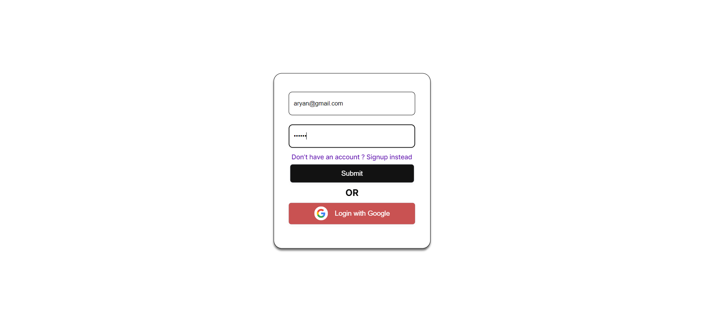
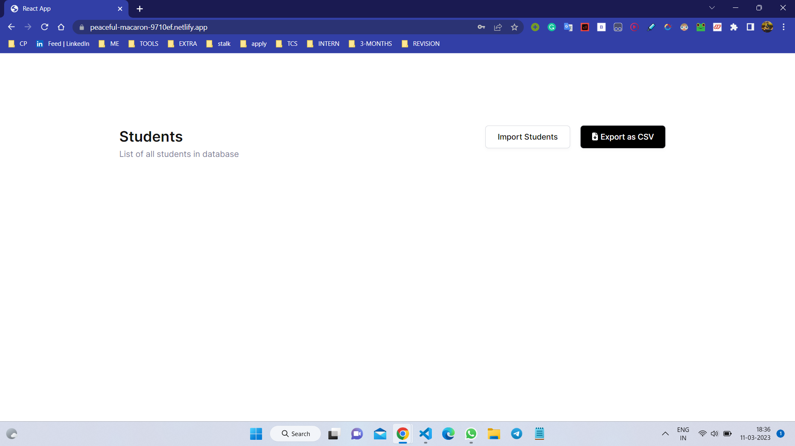
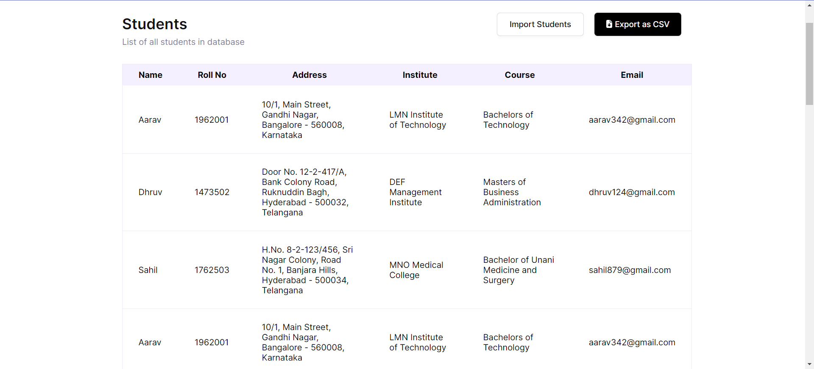

# DentalKart Assignment

https://aryan9211-dentalkart.netlify.app/

---

# Setup steps

### Clone the project

```bash
git clone git@github.com:Aryan-9211/dentalkart-assignment.git
```

### Install dependencies

```bash
npm install
```

### Run the React proejct

```bash
npm start
```

---

## Screenshort of the Project


<br>

<br>

<br>

