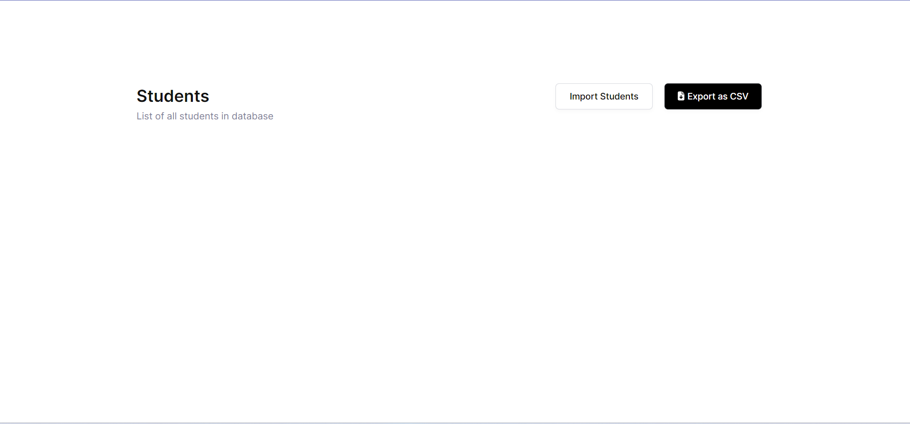

# Devmeet

https://peaceful-macaron-9710ef.netlify.app/

# Setup

````

### Install dependencies

```bash
npm install
````

### Install frontend dependencies

```bash
cd frontend
npm install
```

### Run the Project

```bash
npm run dev
```

### Build for production

```bash
npm run build
```

---

## Screenshort of the Project


<br>

<br>

<br>

<br>
